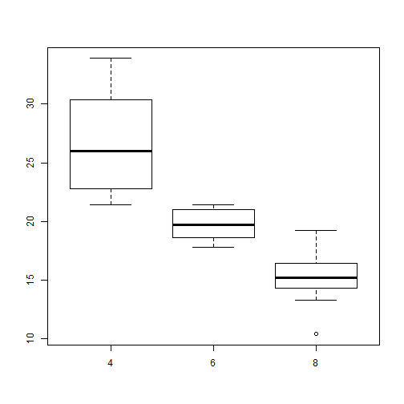

## MTCARS Dataset
This shiny app uses data from the MTCARS dataset.

```r
library(datasets)
head(mtcars)
```

```
##                    mpg cyl disp  hp drat    wt  qsec vs am gear carb
## Mazda RX4         21.0   6  160 110 3.90 2.620 16.46  0  1    4    4
## Mazda RX4 Wag     21.0   6  160 110 3.90 2.875 17.02  0  1    4    4
## Datsun 710        22.8   4  108  93 3.85 2.320 18.61  1  1    4    1
## Hornet 4 Drive    21.4   6  258 110 3.08 3.215 19.44  1  0    3    1
## Hornet Sportabout 18.7   8  360 175 3.15 3.440 17.02  0  0    3    2
## Valiant           18.1   6  225 105 2.76 3.460 20.22  1  0    3    1
```

---

## Output
It displays a boxplot of the selected variable against miles per gallon (mpg).
For example, cylinders (cyl) against mpg.

 

---

## Input Variable
You can specify one of the following variables to plot against mpg:
* Cylinders (cyl)
* Transmission (am)
* Gears (gear)
* Carburetors (carb)
* Weight (wt)
* Displacement (disp)
* Horsepower (hp)

---

## Boxplot Colour
You can also specify one of the following colours for the boxplot:
* White
* Blue
* Green
* Red
* Yellow

---

## Have Fun!
The shiny app can be accessed via the following link:
[http://foocewei.shinyapps.io/mtcars](http://foocewei.shinyapps.io/mtcars)
